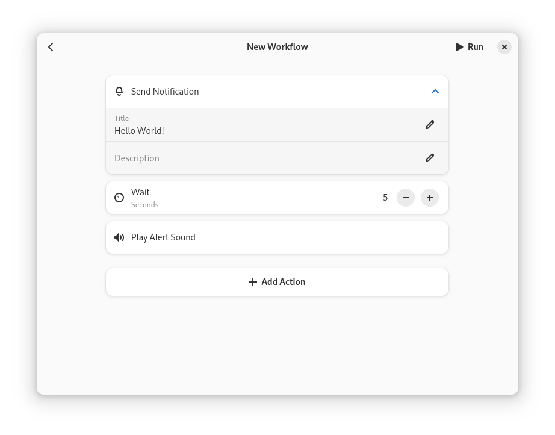

> [!NOTE]
> # This Repository is Archived
> This was an experiment to develop an automation tool for the free desktop. There are plans for other, more extensive frameworks. Some of the ideas behind this (small) project may still be picked up to support those.

  

  # Actions

  Automate your life

  

The project follows the [GNOME Code of Conduct](https://conduct.gnome.org/).
